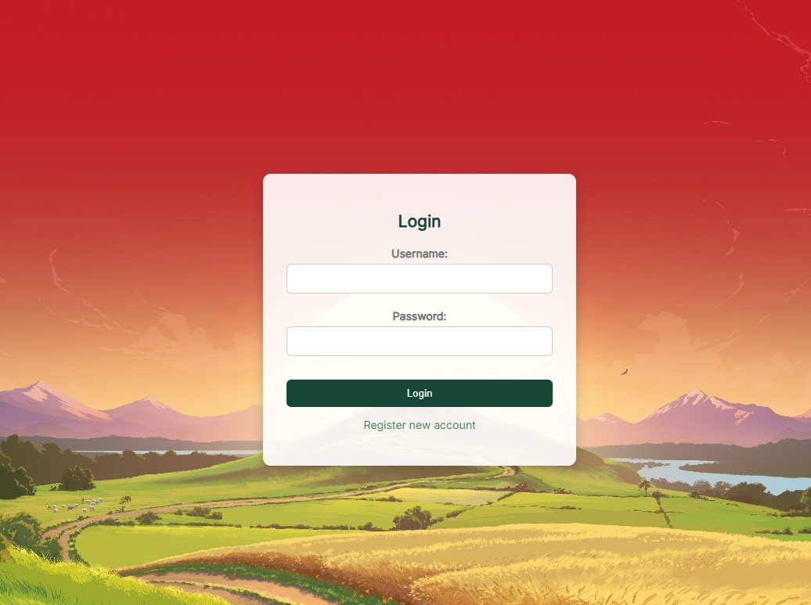
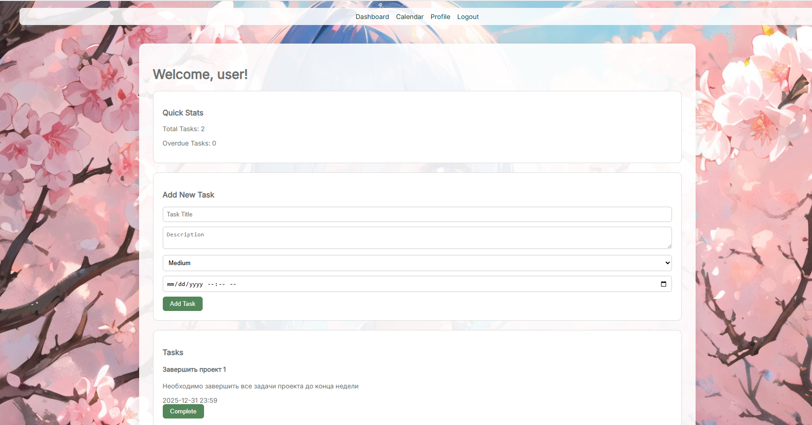
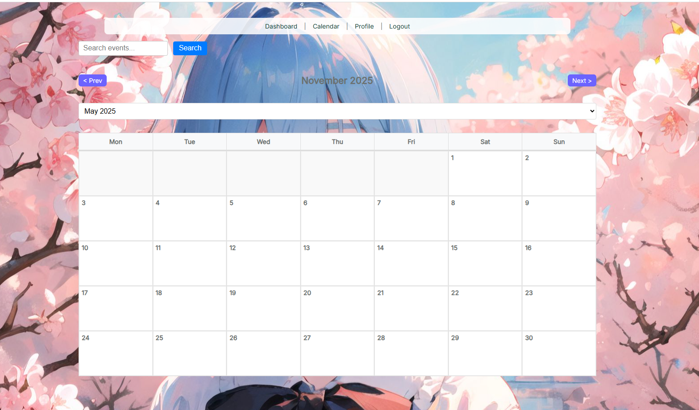
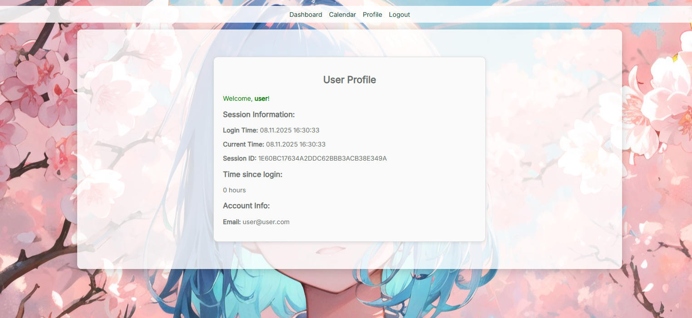
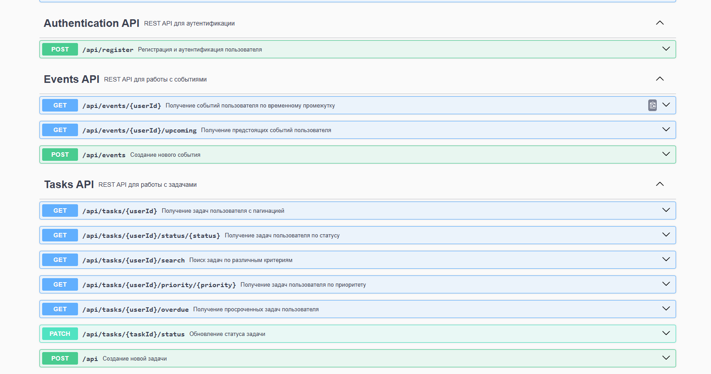

## Digital calendar

## Description:
Цифровой календарь с функцией создания задач и заметок.

## Stack:
- `Spring Boot`  - Фреймворк для создания Java-приложений.
- `Hibernate`  - ORM-фреймворк (`Object-Relational Mapping`), который связывает Java-классы с таблицами в базе данных.
- `Swagger`  - Инструмент для документирования и тестирования `REST API`.
- `Thymeleaf`  - Серверный шаблонизатор (`HTML template engine`) для `Spring MVC`.
- `Postgres`  - Реляционная база данных проекта.
- `Elasticsearch`  - Поисковый движок, используемый для быстрого поиска и фильтрации данных.
- `Redis`  - Система кеширования в памяти, ускоряющая доступ к часто используемым данным.

## Key features:

В проекте реализованы авторизация и регистрация пользователя с шифрованием пароля и 
сохранением в БД. Реализованы html шаблоны для отображения страницы с логином, 
дашбордом, календарем. Реализован поиск событий пользователя с помощью `ElasticSearch`
и кэширование задач с помошью `Redis`. Реализован шедулер для отправки текущего списка задач
пользователя на его почту (Сейчас реализация - письмо сохраняется в папку emails).

## How to run app:

### Run containers:
```bash
  docker-compose up -d
```

### Command to build:
```bash
  mvn clean install
```

## Links:

- http://localhost:8080/ - главная страница
- http://localhost:8080/swagger-ui/index.html - Swagger

## Example:

### Страница авторизации:



### Дашборд:



### Календарь:



### Информация о текущем пользователе (профиль):



[//]: # (### Сообщение с задачами:)


### API методы в Swagger :

